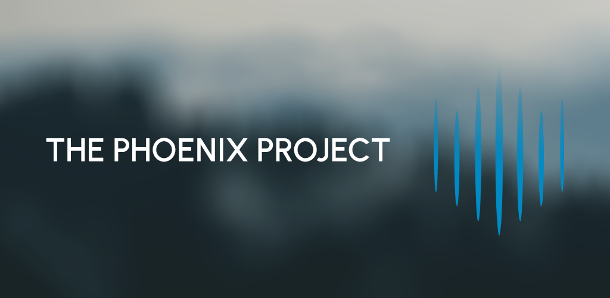
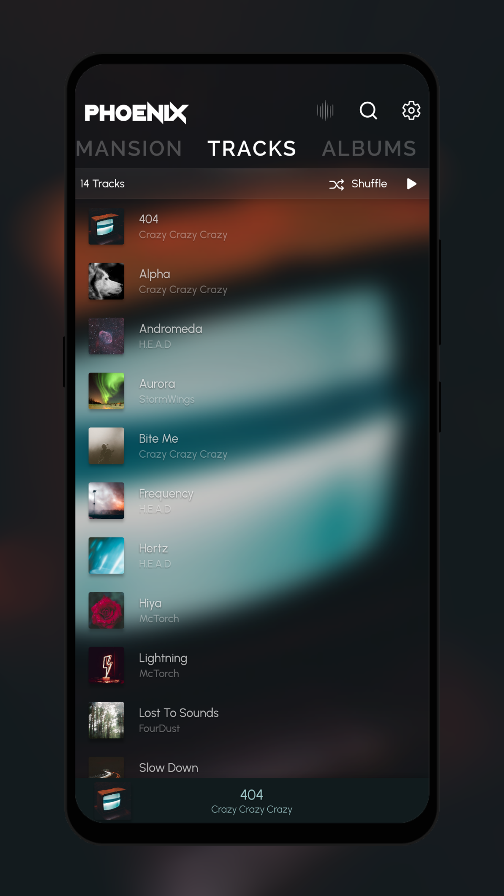
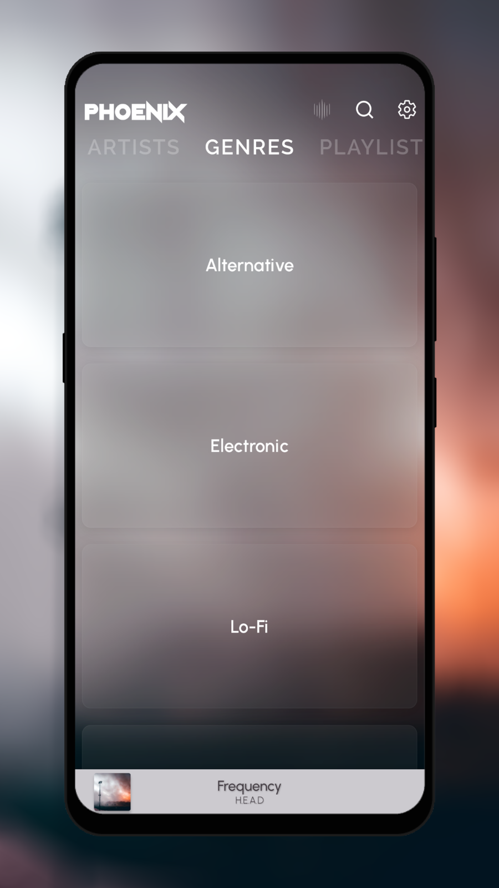
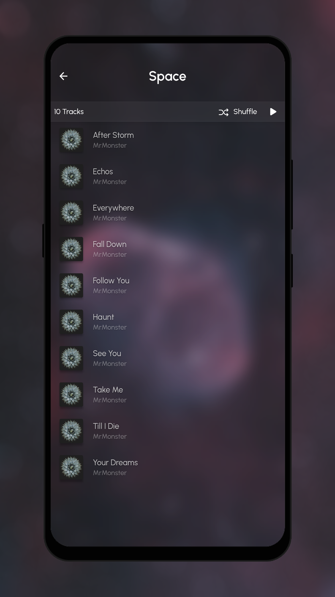
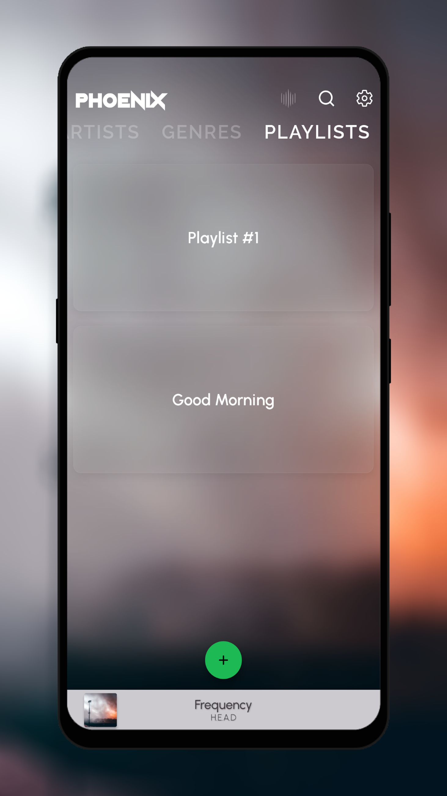
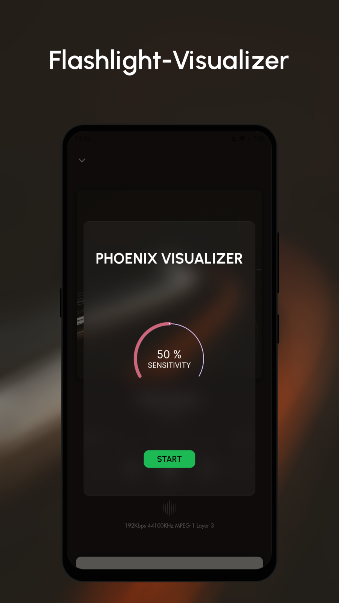
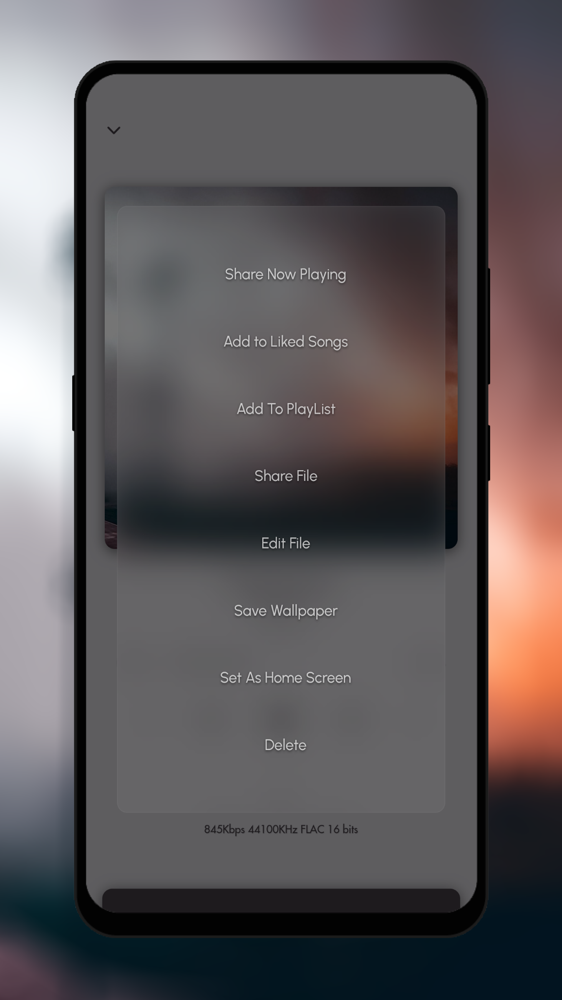

# The Phoenix Project

A Non-Commercial Music Player Made With Flutter.

</div>



## LICENSE
```
Copyright © 2020, Shaan Faydh

The Phoenix Project is free software licensed under GPL v3.0.
You can redistribute and/or modify it under the terms of the GNU General Public License as published by
the Free Software Foundation, either version 3 of the License, or (at your option) any later version.

The Phoenix Project is distributed in the hope that it will be useful, but WITHOUT ANY WARRANTY;
without even the implied warranty of MERCHANTABILITY or FITNESS FOR A PARTICULAR PURPOSE.
See the GNU General Public License for more details.
```
[View License](https://github.com/shaan-mephobic/The-Phoenix-Project/blob/master/LICENSE)

