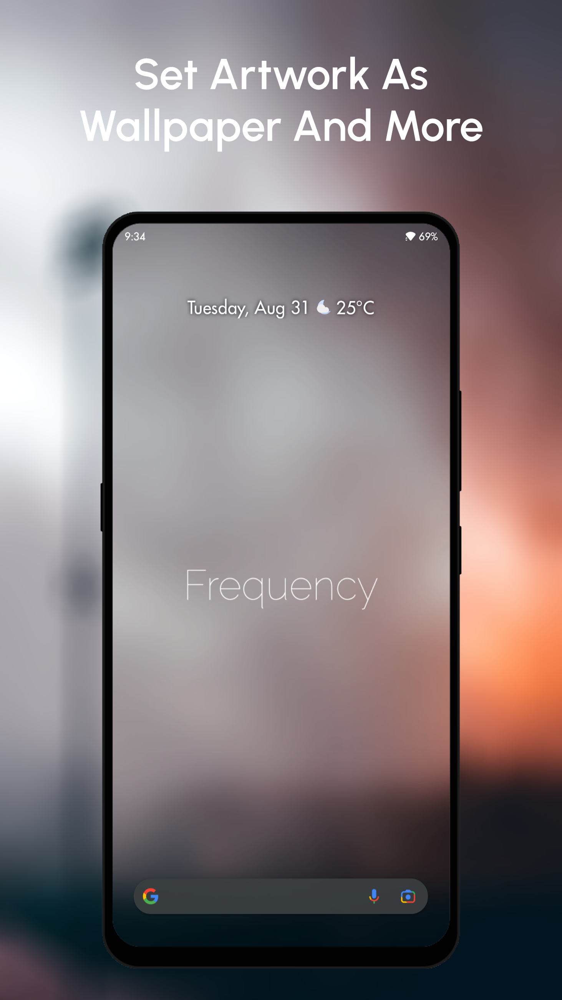

# The Phoenix Project
A Non-Commercial Music Player Made With Flutter.

## Download
[](https://play.google.com/store/apps/details?id=com.Phoenix.project)

## Why Phoenix?
* Beautiful Glassmorphism Design
* Lyrics
* A Flashlight-Visualizer
* Share Now-Playing
* Ad-Free
* Wallpapers From Artwork

And a bunch more. Why not check it yourself?

## Preview
         

## TODO
* Android 11 support for editing and deleting files
* Migrate to null-safety
* Improve performance and stability
* Lint code

## LICENSE
```
Copyright © 2020, Shaan Faydh

The Phoenix Project is free software licensed under GPL v3.0.
You can redistribute and/or modify it under the terms of the GNU General Public License as published by
the Free Software Foundation, either version 3 of the License, or (at your option) any later version.

The Phoenix Project is distributed in the hope that it will be useful, but WITHOUT ANY WARRANTY;
without even the implied warranty of MERCHANTABILITY or FITNESS FOR A PARTICULAR PURPOSE.
See the GNU General Public License for more details.
```
[View License](https://github.com/shaan-mephobic/The-Phoenix-Project/blob/master/LICENSE)

